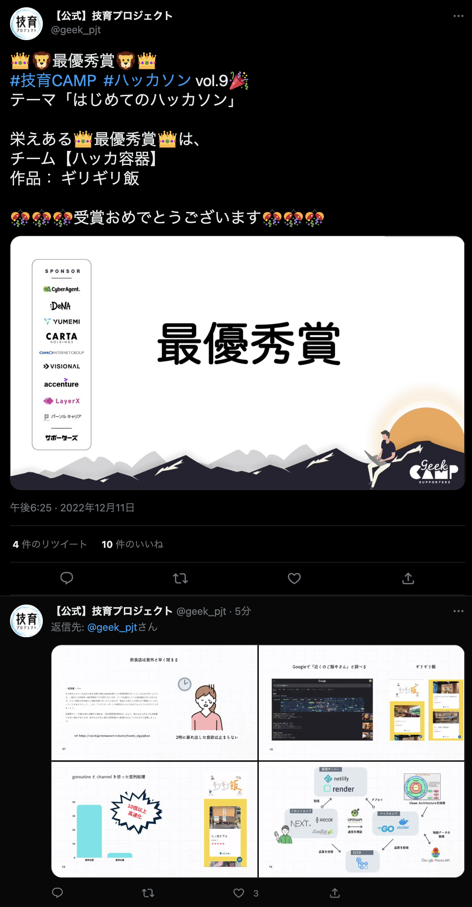

# ギリギリ飯

[](https://github.com/momeemt/2000s/actions/workflows/frontend.yml)


ギリギリ飯 is a service that provides a list of open restaurants in the vicinity of your current location.

https://girigirimeshi.netlify.com

## Dev
The frontend is implemented in Next.js and the backend in Go.

### Required
- make
- Docker

### Build Frontend

```sh
cd frontend
yarn install
yarn dev
```

### Build Backend

```sh
cd backend
make build
make up
```

## Awards



https://twitter.com/geek_pjt/status/1601870885883109376?s=20&t=cFW1IIEpq0naJqRP7v2Wkg

This application was developed in a hackathon by the Geek Project and won the grand prize.